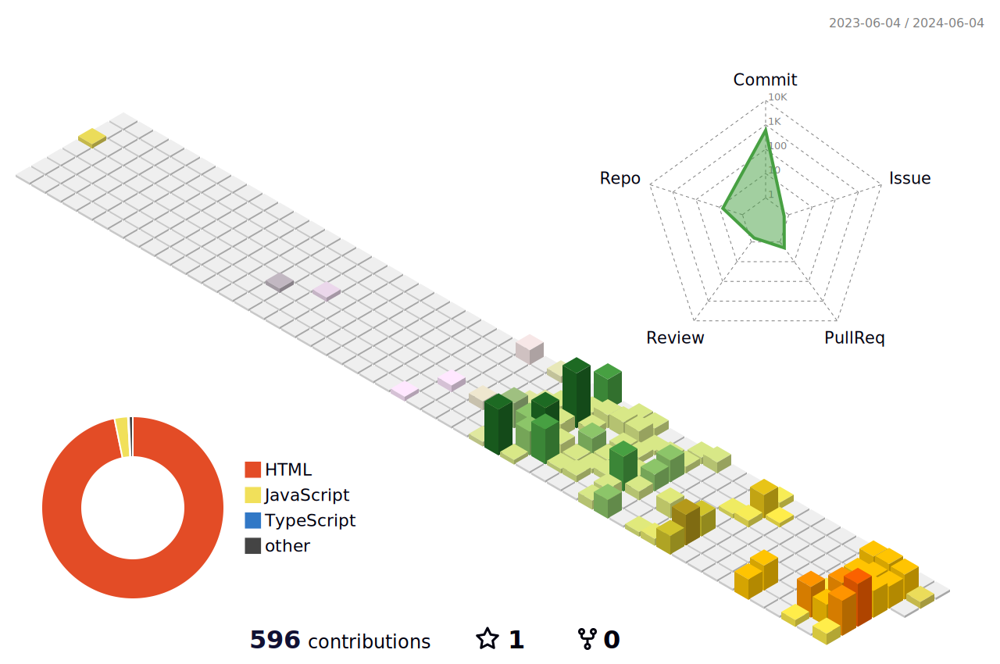

  
<!-- 3D 프로필 -->

  
<!-- Hits -->

<!-- Github Streak -->

  
<!-- Profile -->

<!-- <a href="https://hahm.notion.site/80bf3e445667489f8634595cc71d8af4"> -->

<a href="https://www.instagram.com/ahuuae/">

  <!-- Catchprase -->
<!-- 

 -->

    
  

